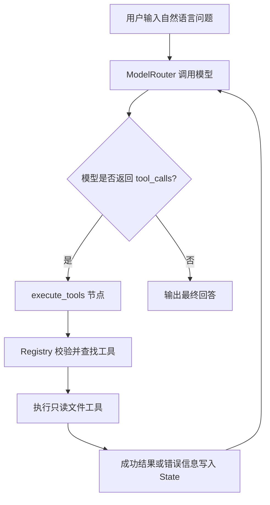

# Repo Agent

一个基于 Python、DeepSeek Tool Calling 和 LangGraph 的命令行代码仓库阅读 Agent。

用户可以指定一个本地代码仓库并提出自然语言问题。Agent 会根据问题自主选择只读工具，获取仓库中的真实文件信息，再基于工具结果生成回答。

## 核心流程



## 已实现能力

- 使用 `ModelRouter` 隔离模型名称、API 地址和 SDK 调用。
- 通过 Tool Schema 向模型声明工具名称、用途和参数结构。
- 通过 Tool Registry 将模型选择的工具名映射到真实 Python 函数。
- 校验必填参数、额外参数和字符串类型，避免错误参数进入文件工具。
- 使用普通 Python Agent Loop 跑通核心流程，并保留为 LangGraph 版本的对照实现。
- 使用 LangGraph 的 State、节点、固定边和条件边表达模型与工具之间的循环。
- 将工具成功结果和可预期错误统一转换成 `role="tool"` 消息写回 State。
- 在 CLI 中显示模型选择的工具名称和参数，便于观察和调试 Agent 行为。

## 只读工具

| 工具 | 作用 |
|---|---|
| `list_files` | 列出目标仓库根目录下的文件和文件夹 |
| `read_file` | 读取目标仓库内部的 UTF-8 文本文件 |
| `search_text` | 在目标仓库的 Python 文件中搜索文本并返回路径、行号和片段 |

## 安全与可靠性边界

- 仓库路径由程序控制，不允许模型自行更换目标仓库。
- `read_file` 会解析真实路径并阻止访问仓库目录外的文件。
- 单个文件读取限制为 1 MiB；定点读取超限会报错，批量搜索会跳过超大文件。
- 每次 LangGraph 运行最多执行 20 个图步骤，防止模型与工具无限循环。
- 模型客户端设置 60 秒超时，并将 SDK 超时转换为项目级异常。
- API Key 只从本地 `.env` 读取，`.env` 已被 Git 忽略。
- 第一版只提供读取类工具，不提供写文件、删文件或执行系统命令的能力。

## 项目结构

```text
repo_agent/
├── project/
│   ├── repo_agent/
│   │   ├── __main__.py          # python -m repo_agent 入口
│   │   ├── cli.py               # 命令行输入、输出和工具调用展示
│   │   ├── model_router.py      # DeepSeek 客户端和模型路由
│   │   ├── state.py             # Agent State schema 与消息 reducer
│   │   ├── agent.py             # 普通 Python Agent Loop 对照实现
│   │   ├── langgraph_agent.py   # 当前使用的 LangGraph Agent
│   │   ├── exceptions.py        # 项目级限制与超时异常
│   │   └── tools/
│   │       ├── registry.py      # Tool Schema、注册表和参数校验
│   │       └── file_tools.py    # 三个只读仓库工具
│   ├── design/                  # 项目设计与学习路径
│   ├── .env.example             # 可安全提交的环境变量模板
│   └── requirements.txt         # Python 依赖版本
├── cowork/                      # 长期决策和任务进度
│   ├── DECISIONS.md             # 长期项目决策
│   └── TASKS.md                 # 当前任务进度
├── README.md                    # 项目介绍、安装和使用说明
└── .gitignore                   # 本地环境、缓存和学习资料忽略规则
```

## 环境要求

- Python 3.13
- 一个可用的 DeepSeek API Key
- Windows PowerShell（下面的示例命令使用 PowerShell）

## 安装

克隆仓库并进入可运行项目目录：

```powershell
git clone https://github.com/weiy83112-sketch/repo_agent.git
cd repo_agent\project
```

创建并进入虚拟环境：

```powershell
python -m venv .venv
Set-ExecutionPolicy -Scope Process -ExecutionPolicy RemoteSigned
.\.venv\Scripts\Activate.ps1
```

安装依赖：

```powershell
python -m pip install -r requirements.txt
```

创建本地环境变量文件：

```powershell
Copy-Item .env.example .env
```

打开 `.env`，将占位内容替换为自己的 Key：

```text
DEEPSEEK_API_KEY=your_deepseek_api_key_here
```

不要把真实 Key 写进 Python 源码，也不要提交 `.env`。

## 启动

在 `project/` 目录中运行：

```powershell
python -m repo_agent --repo <目标代码仓库路径>
```

示例：

```powershell
python -m repo_agent --repo C:\Users\your-name\Desktop\some-project
```

进入交互后可以输入：

```text
repo_agent> 这个仓库的入口文件在哪里？
repo_agent> 帮我解释这个项目的核心调用流程
repo_agent> 搜索所有使用 ModelRouter 的位置
```

也可以手动调用只读命令：

```text
/list
/read README.md
/search ModelRouter
/exit
```

## 当前限制

- `search_text` 当前只搜索 `.py` 文件。
- 每次自然语言问题都会创建新的 Agent State，暂未实现跨问题会话记忆和持久化 Checkpoint。
- 当前模型路由只实现了第一版 `complex` 能力。
- 自动化文件工具测试和 Agent 集成测试仍在后续任务中。
- 当前版本只读取代码仓库，不修改代码，也不执行仓库命令。

## 设计资料

- [CLI Repo Agent Design](project/design/repo_agent/cli-repo-agent-design.md)
- [Repo Agent Learning Path](project/design/repo_agent/repo-agent-learning-path.md)
- [Project Decisions](cowork/DECISIONS.md)
- [Task Board](cowork/TASKS.md)

## 项目定位

这是一个以理解 Agent 核心机制和工程边界为目标的应届生作品集项目，重点展示：

- Tool Calling 从模型意图到真实函数执行的完整链路。
- Agent State 中用户消息、模型消息和工具消息的变化。
- 普通 Python Loop 与 LangGraph 状态图之间的映射。
- 模型、Agent 流程、工具层和 CLI 展示层之间的职责隔离。
- 对路径、参数、文件大小、步骤次数、超时和密钥的安全处理。
